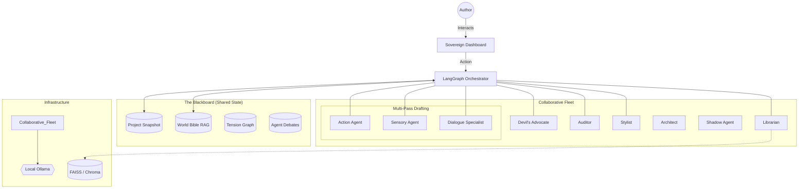

# Architecture Summary: BookBot_06

This document outlines the high-level architecture and component interactions of the BookBot Narrative Engine.

## 1. System Overview
BookBot_06 follows a **Blackboard Architecture** where **LangGraph** serves as the orchestrator, managing a shared "World Bible" and "Blackboard" that specialized agents collaborate on asynchronously.

## 2. Component Diagram
The following diagram visualizes the collaborative nature of the Blackboard model.

## 3. Layer Definitions

### UI Layer (Sovereign Dashboard)
A responsive dashboard providing views for different facets of creation:
- **World Bible Tab**: Full management of characters, locations, and items.
- **Tension Visualizer**: Interactive chart showing emotional pacing.
- **Split-Screen Drafting**: AI multi-pass drafting on the left, adversarial redlines on the right.
- **Project Selector**: Sidebar for managing snapshots and iterations.

### Orchestration Layer (LangGraph)
Manages the "Blackboard." It ensures that:
- Agents are triggered based on state changes (e.g., if a new character is added, the Librarian updates the Bible).
- Multi-pass loops for drafting are executed in sequence.
- Conflict warnings are surfaced to the user.

### Agent Layer (The Fleet)
A non-linear fleet of specialized personas:
- **The Architect**: Manages high-level schema and plot "North Star."
- **The Librarian**: RAG-based lookup; populates the world with meaningful artifacts.
- **The Devil's Advocate**: Contrarian that challenges clichés and forces creative pivots.
- **The Auditor**: Logic gap checker (e.g., "How did he get to the tower if the tide was in?").
- **The Stylist**: Enforces tone and "voice" constraints (e.g., "Melancholic").
- **The Shadow Agent**: Tracks unspoken subtext and character knowledge states.
- **Drafting Fleet**: Sequential agents (Action -> Sensory -> Dialogue) for iterative sculpting.

### Robustness Layer (Deterministic Logic)
The "Pythonic-First" component that protects the system from LLM non-determinism. It performs:
- **Block Stripping**: Removing thinking tags or conversational filler.
- **JSON Validation**: Ensuring the agent's output conforms to the registry schema.
- **Fallback Handling**: Graceful degradation if the LLM fails to provide a usable response.
