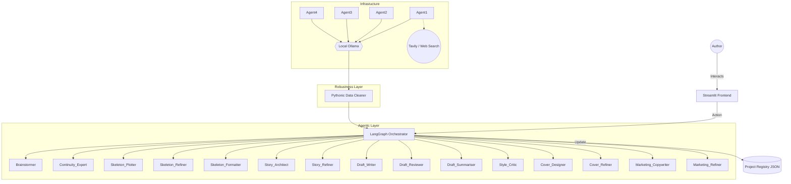

# Architecture Summary: BookBot_06

This document outlines the high-level architecture and component interactions of the BookBot Narrative Engine.

## 1. System Overview
BookBot_06 follows a modular, agentic architecture where **LangGraph** serves as the stateful orchestrator, managing transitions between different creative phases.

## 2. Component Diagram
The following diagram visualizes the relationships between the UI, agents, and local LLM services.

## 3. Layer Definitions

### UI Layer (Streamlit)
A responsive dashboard providing views for different phases:
- **Plotting View**: For brainstorming and arc definition.
- **Structural View**: For chapter skeleton management.
- **Drafting View**: For bulk generation and manual editing.

### Orchestration Layer (LangGraph)
Manages the "Source of Truth" (State). It ensures that:
- Phase transitions are valid.
- Data generated in Phase 1 is correctly prepared for Phase 2.
- Errors in agent execution are handled gracefully.

### Agent Layer
A fleet of 15+ specialized personas organized by phase:
- **Phase 1 (Input/Consistency)**: Brainstormer (Agent 01a) and Continuity Expert (Agent 01b).
- **Phase 2 (Skeleton)**: Plotter, Refiner, and Formatter (Agents 02a-c).
- **Phase 3 (Story)**: Story Architect and Refiner (Agents 03a-b).
- **Phase 4 (Draft)**: Writer, Reviewer, Summarizer, and Style Critic (Agents 04a-d).
- **Phase 5 (Manuscript/Cover)**: Cover Designer and Refiner (Agents 05a-b).
- **Phase 6 (Marketing)**: Marketing Copywriter and Refiner (Agents 06a-b).

### Robustness Layer (Deterministic Logic)
The "Pythonic-First" component that protects the system from LLM non-determinism. It performs:
- **Block Stripping**: Removing thinking tags or conversational filler.
- **JSON Validation**: Ensuring the agent's output conforms to the registry schema.
- **Fallback Handling**: Graceful degradation if the LLM fails to provide a usable response.
