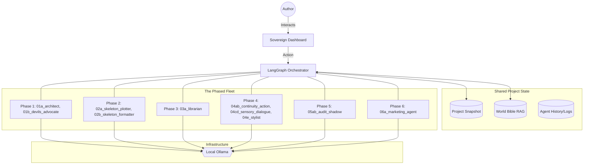

# Architecture Summary: BookBot_06

This document outlines the high-level architecture and component interactions of the BookBot Narrative Engine.

## 1. System Overview
BookBot_06 follows a **Phased Pipeline with Shared State**. The system progresses through 6 distinct phases (Planning to Publication). While the overall structure is linear, agents can be revisited and re-run as needed.

## 2. Component Diagram
The following diagram visualizes the phased pipeline and shared state model.

## 3. Layer Definitions

### UI Layer (Sovereign Dashboard)
A responsive dashboard providing views for different facets of creation:
- **World Bible Tab**: Full management of characters, locations, and items.
- **Style & Voice**: Configuration for tone, stylistic rules, and reference samples.
- **Split-Screen Drafting**: AI multi-pass drafting on the left, adversarial redlines and shadow context on the right.
- **Audit Log**: Conflict registry and real-time session telemetry.
- **Project Selector**: Sidebar for managing snapshots and iterations.

### Orchestration Layer (LangGraph)
Manages the phased execution and agent transitions. It ensures that:
- The project state is propagated correctly between phases.
- Multi-pass loops for drafting (Phase 4) are executed in sequence.
- Continuity is maintained via the shared World Bible.

### Agent Layer (The Fleet)
A non-linear fleet of specialized personas organized by creation phase:

- **Phase 1: Brainstorming**
    - **01a_architect**: Manages high-level schema and plot "North Star."
    - **01b_devils_advocate**: Contrarian that challenges clichés and forces creative pivots.
- **Phase 2: Structuring**
    - **02a_skeleton_plotter**: Generates chapter beats and narrative structure.
    - **02b_skeleton_formatter**: Ensures plot output matches registry schema.
- **Phase 3: World Building**
    - **03a_librarian**: RAG-based lookup; populates the world with meaningful artifacts.
- **Phase 4: Drafting (3-Step Fleet)**
    - **04ab_continuity_action**: Combined continuity check and skeletal drafting.
    - **04cd_sensory_dialogue**: Atmospheric layering and vocal refinement.
    - **04e_stylist**: Final stylistic enforcement.
- **Phase 5: Audit & Shadow**
    - **05ab_audit_shadow**: Logic gap checker and subtext tracker.
- **Phase 6: Export & Marketing (Implemented - Untested)**
    - **06a_marketing_agent**: Generates blurbs, meta-data, and query letters.

### Robustness Layer (Deterministic Logic)
The "Pythonic-First" component that protects the system from LLM non-determinism. It performs:
- **Block Stripping**: Removing thinking tags or conversational filler.
- **JSON Validation**: Ensuring the agent's output conforms to the registry schema.
- **Fallback Handling**: Graceful degradation if the LLM fails to provide a usable response.
