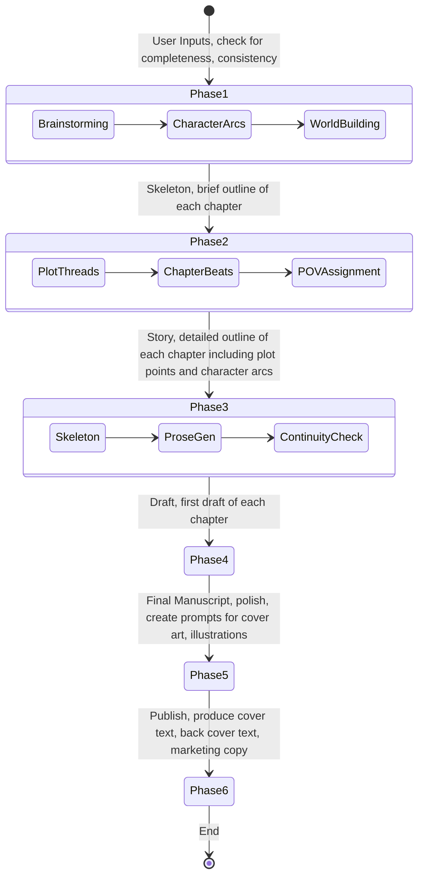

# Narrative Workflow: BookBot_06

This document defines the end-to-end creation process and the data transformations between phases.

## 1. Creation Lifecycle
BookBot_06 utilizes a multi-step pipeline where each phase builds upon the structured output of the previous one.

## 2. Data Element Map

| Phase | Input Elements | Output Elements | Key Data Objects |
|-------|----------------|-----------------|------------------|
| **1. Plotting** | Prompt / Concept | Plot Threads, Characters, Setting | `world_bible.json`, `plot_arcs.json` |
| **2. Structuring** | Plot Threads, Setting | Chapter Skeletons, Scene Beats | `chapter_registry.json` |
| **3. Drafting** | Chapter Skeletions, POV | Initial Prose Drafts | `drafts/*.md` |
| **4. Polishing** | Prose Drafts, Style Guide | Final Manuscript, Critique | `revised_drafts/*.md` |

## 3. Propagation Integrity
To prevent the "Regression" issue seen in v0.5, data propagation follows these rules:
- **Upward-Only Flow**: While a user can go back to Phase 1 to change a plot point, doing so must trigger a "Dirty State" flag in Phases 2 and 3, requiring a re-sync rather than an automated (and potentially destructive) overwrite.
- **Context Pruning**: The Scribe (Phase 3) is given the **Chapter Skeleton** + **World Bible Summary** + **Previous Chapter Summary** + **Last 1000 words of previous chapter**. It is *not* given the full text of all previous chapters, preserving context window and focus.
- **Human-in-the-Loop**: Each phase transition requires a manual "Commit" from the user to ensure the AI's structural decisions align with the author's vision.
