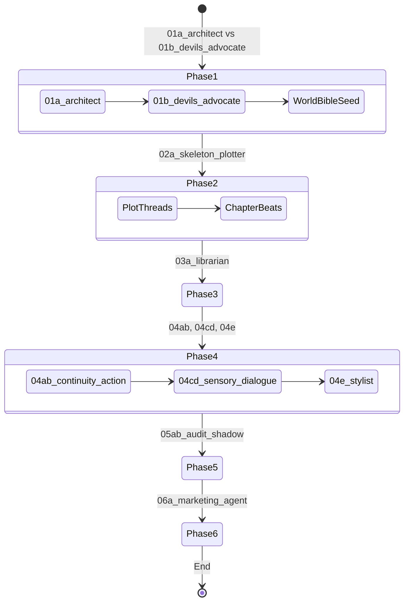

# Narrative Workflow: BookBot_06

This document defines the end-to-end creation process and the data transformations between phases.

## 1. Creation Lifecycle
BookBot_06 utilizes a multi-step pipeline where each phase builds upon the structured output of the previous one.

## 2. Data Element Map

| Phase | Input Elements | Output Elements | Key Data Objects |
|-------|----------------|-----------------|------------------|
| **1. Brainstorming** | Prompt / Concept | Plot Threads, Characters, Setting | `ProjectRegistry.world_bible`, `history` |
| **2. Structuring** | Plot Threads, Setting | Chapter Skeletons | `ProjectRegistry.chapters` |
| **3. World Building** | Entity Topics, Context | Structured Lore Entities, RAG Index | `WorldBible.entities` |
| **4. Drafting** | Chapter Beats, Continuity Brief | Incremental Prose (Action -> Sensory -> Dialogue -> Style) | `Chapter.content` |
| **5. Polishing** | Draft Content, Style Profile | Audited Manuscript, Shadow Context | `Chapter.audit_logs`, `shadow_context` |
| **6. Export** | Final Manuscript | Markdown / DOCX / Marketing Blurbs | `exports/` |

## 3. Propagation Integrity
To prevent the "Regression" issue seen in v0.5, data propagation follows these rules:
- **Upward-Only Flow**: While a user can go back to Phase 1 to change a plot point, doing so must trigger a "Dirty State" flag in subsequent phases, requiring a re-sync rather than an automated (and potentially destructive) overwrite.
- **Context Pruning**: The **Drafting Fleet (Phase 4)** is given the **Chapter Skeleton** + **World Bible Summary** + **Previous Chapter Summary** + **Last 1000 words of previous chapter**. It is *not* given the full text of all previous chapters, preserving context window and focus.
- **Human-in-the-Loop**: Each phase transition requires a manual "Commit" from the user to ensure the AI's structural decisions align with the author's vision.
